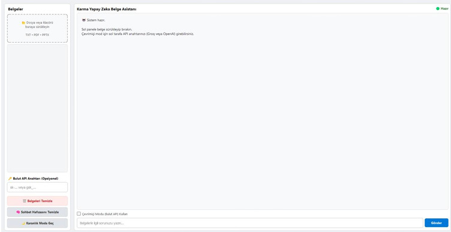

# Projenin Adı
Yerel Yapay Zeka Belge Asistanı (Karma Mimari)

## Problem Tanımı
Kullanıcıların ve kurumların hassas belgelerini (şirket raporları, araştırma verileri vb.) analiz etmek için bulut tabanlı yapay zeka servislerine (ChatGPT, Claude vb.) yüklemek zorunda kalması, ciddi veri gizliliği ve güvenlik ihlallerine yol açmaktadır. Ayrıca, internet bağlantısının olmadığı kısıtlı ortamlarda uzun metinlerin, PDF'lerin ve sunumların hızlıca analiz edilip bilgi çıkarımı yapılması mevcut araçlarla mümkün olmamaktadır.

## Hedef Kullanıcı
* Hassas ve gizli verilerle çalışan hukuk büroları ve kurumsal şirketler.
* Veri mahremiyetine önem veren akademisyenler, araştırmacılar ve öğrenciler.
* İnternet kısıtlaması olan veya tamamen çevrimdışı ortamlarda belge analizi yapması gereken profesyoneller.

## Çözümün Kısa Açıklaması
Bu proje, tamamen cihaz üzerinde çevrimdışı çalışabilen, gizlilik odaklı bir masaüstü belge asistanıdır. Sürükle-bırak özelliği ile TXT, PDF ve PPTX (PowerPoint) dosyalarını kabul eder. Arayüz kilitlenmelerini önleyen asenkron (Threading) yapısı sayesinde, yerel işlemci gücüyle belgeleri okur ve soruları cevaplar. Ayrıca hız talep eden kullanıcılar için arayüze entegre edilmiş dinamik bir API yönetim paneli bulunur; kullanıcılar kendi şifrelerini girerek sistemi anında bulut (OpenAI veya Groq) mimarisine geçirebilirler.

## Kullanılan Teknolojiler
* **Programlama Dili:** Python 3.10+ (PyInstaller ile tekil çalıştırılabilir formata dönüştürülmüştür)
* **Arayüz (GUI):** PyQt5
* **Yerel Dil Modeli (LLM):** Ollama (Qwen 2.5:7b modeli)
* **Opsiyonel Bulut API:** OpenAI API (GPT-3.5) ve Groq API (Llama-3)
* **Belge Ayrıştırma:** `pypdf` (PDF işleme), `python-pptx` (Sunum işleme)

## Sistem Mimarisi veya İş Akışı
1. **Akıllı Bağımlılık Kontrolü:** Program başlatıldığında sistemde Ollama ve Qwen2.5 modelinin varlığını kontrol eder. Eksiklik durumunda kullanıcıyı uyararak arayüz üzerinden tek tıkla indirme işlemi başlatır.
2. **Veri Girişi:** Kullanıcı dosyaları veya klasörleri arayüzün sol paneline sürükleyip bırakır.
3. **Ayrıştırma (Parsing):** Belgelerin içindeki metinler ayıklanır ve birleştirilerek sistem hafızasına alınır.
4. **Karma Karar Mekanizması (Akıllı Yönlendirme):**
   * Kullanıcı sol panele `sk-...` formatında bir şifre girerse istek OpenAI sunucularına iletilir.
   * Kullanıcı sol panele `gsk_...` formatında bir şifre girerse istek ücretsiz ve yüksek hızlı Groq (Llama-3) sunucularına iletilir.
   * Çevrimiçi mod kapalıysa, istek tamamen gizlilik içinde yerel cihaza (Ollama) iletilir.
5. **Asenkron Çıktı:** `QThread` üzerinde çalışan işçi sınıfı, ana arayüzü dondurmadan üretilen cevabı sohbet ekranına yansıtır.

## Kurulum Adımları
Proje, son kullanıcı odaklı olarak derlenmiştir ve karmaşık kod kurulumları gerektirmez:
1. Teslim edilen ZIP dosyasını bilgisayarınızda bir klasöre çıkartın.
2. Klasör içerisindeki çalıştırılabilir uygulamaya (`main.exe`) çift tıklayın.
3. Program açıldığında sisteminizde yerel yapay zeka motoru (Ollama) bulunamazsa, ekrana gelen uyarı penceresinden **"Evet, İndir"** butonuna basarak gerekli modelin (4.7 GB) otomatik olarak kurulmasını sağlayabilirsiniz.
4. Çevrimiçi modu kullanmak istiyorsanız, sol taraftaki API paneline Groq veya OpenAI anahtarınızı girebilirsiniz.

## Kullanım Biçimi
* Uygulama açıldığında sol taraftaki alana okunmasını istediğiniz PDF, TXT veya PPTX belgelerini sürükleyin.
* İnternet bağlantınız varsa ve saniyeler içinde cevap almak isterseniz sol paneldeki "Bulut API Anahtarı" kısmına şifrenizi girin ve alt kısımdaki "Çevrimiçi Modu Kullan" seçeneğini işaretleyin.
* Sağ alt köşedeki girdi kutusuna belgelere dair sorunuzu yazın ve "Gönder" butonuna basın. Uygulama sizin için belgeyi analiz edip cevaplayacaktır.

## Örnek Ekran Görüntüleri
*(Not: GitHub deponuza yüklediğiniz ekran görüntülerini buraya bağlayın)*
* ``
* 
* ``

## Test Sonuçları
* **Bağımlılık Yönetimi:** Modelin kurulu olmadığı temiz bir sistemde program çalıştırıldığında, pop-up tetikleyicisi başarılı bir şekilde devreye girmiş ve arka planda `ollama pull` komutunu çalıştırmıştır.
* **Dosya Okuma:** 50 sayfalık PDF dosyaları, sürükle-bırak yöntemiyle 2 saniyenin altında hatasız şekilde ayrıştırılarak hafızaya alınmıştır.
* **Akıllı API Yönlendirmesi:** Arayüze girilen Groq (`gsk_...`) şifresi ile sistem başarıyla Llama-3 modeline bağlanmış, 1 saniyenin altında gecikme ile (ücretsiz olarak) sonuç üretmiştir.
* **Yerel Model Yanıt Süresi:** Çevrimdışı modda, harici GPU olmayan sistemlerde yanıt üretimi metin uzunluğuna bağlı olarak 1-2 dakika sürmüş, bu süreçte arayüz donmamış ve stabil kalmıştır.